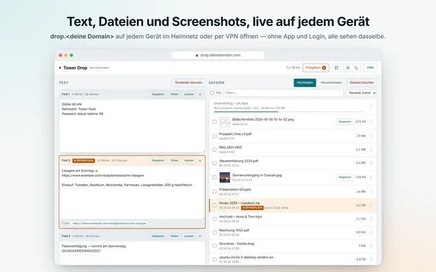
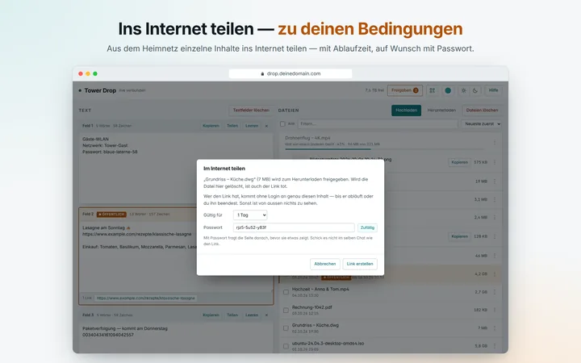
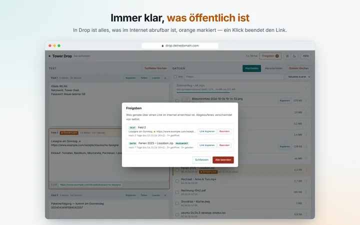
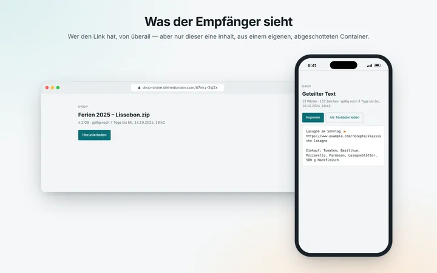
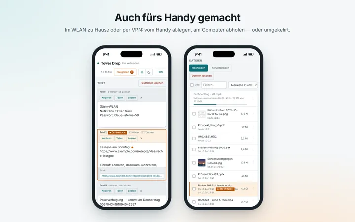
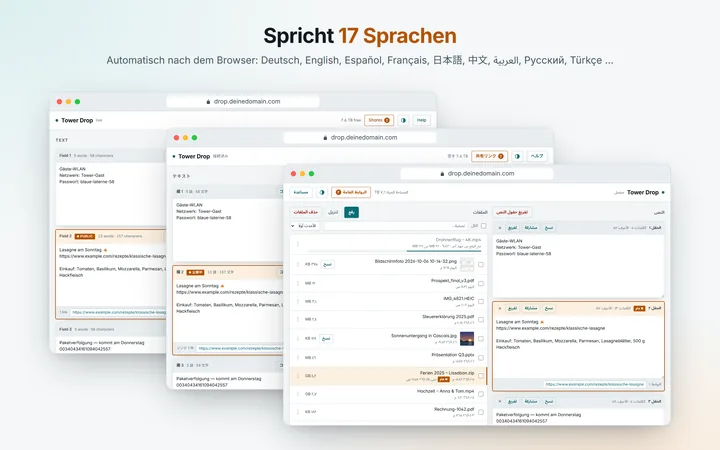
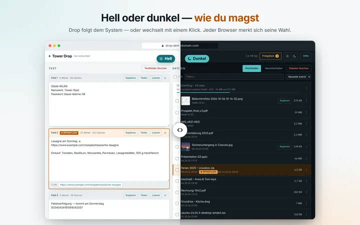
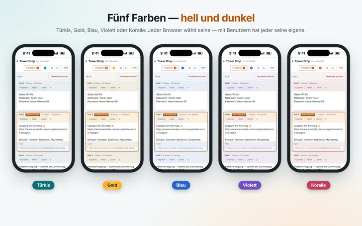
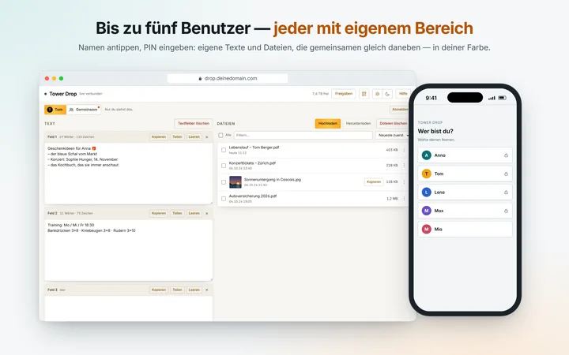
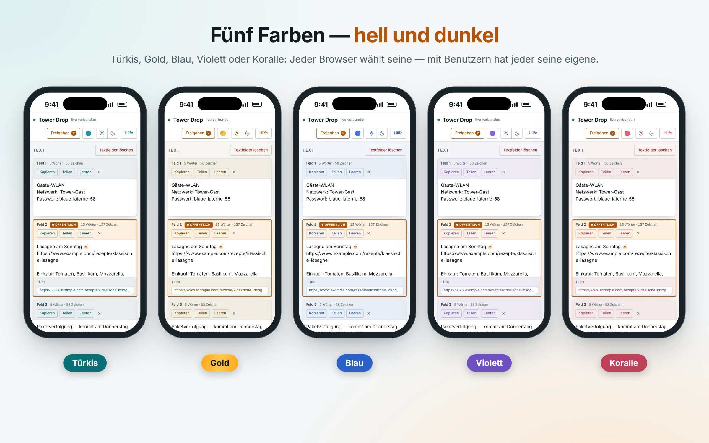

<h1>
  <picture>
    <source media="(prefers-color-scheme: dark)" srcset="docs/title-dark.svg">
    
  </picture>
</h1>

[English](README.md) · **Deutsch** · [dropnook.dropnook.app](https://dropnook.dropnook.app/de/)

**Instant-Share fürs Heimnetz — wie AirDrop, nur für jedes Gerät.** Einen
Text oder eine Datei vom Handy auf den PC bringen, von Windows zum Mac, von
Android zum iPhone: eine Webseite öffnen, hineinziehen, und es ist sofort auf
jedem anderen Gerät. Ohne App, ohne Login, ohne Cloud — alles bleibt auf deinem
eigenen Server.

Muss etwas aus dem Haus? Einzelne Dateien oder Texte über einen Link teilen,
der von selbst abläuft, auf Wunsch mit Passwort. Ausgeliefert wird er von einem
zweiten, abgeschotteten Container — Drop selbst ist aus dem Internet nie
erreichbar.

*Dropnook™* heisst das Projekt; auf deinen Geräten heisst es einfach *Drop* — die
Seite nennt sich nach deinem Server „Tower Drop“.

<p align="center">
  <a href="https://dropnook.dropnook.app/gallery/?lang=de"><picture><source media="(prefers-color-scheme: dark)" srcset="docs/screenshots/de/slideshow-dark.webp"></picture></a>
</p>

<p align="center">
  <a href="https://dropnook.dropnook.app/gallery/?lang=de#1" title="Text und Dateien"><picture><source media="(prefers-color-scheme: dark)" srcset="docs/screenshots/de/1-overview-dark-thumb.webp"></picture></a>
  <a href="https://dropnook.dropnook.app/gallery/?lang=de#2" title="Teilen"><picture><source media="(prefers-color-scheme: dark)" srcset="docs/screenshots/de/2-share-dark-thumb.webp"></picture></a>
  <a href="https://dropnook.dropnook.app/gallery/?lang=de#3" title="Was öffentlich ist"><picture><source media="(prefers-color-scheme: dark)" srcset="docs/screenshots/de/3-shares-dark-thumb.webp"></picture></a>
  <a href="https://dropnook.dropnook.app/gallery/?lang=de#4" title="Ansicht des Empfängers"><picture><source media="(prefers-color-scheme: dark)" srcset="docs/screenshots/de/4-public-dark-thumb.webp"></picture></a>
  <a href="https://dropnook.dropnook.app/gallery/?lang=de#5" title="Handy"><picture><source media="(prefers-color-scheme: dark)" srcset="docs/screenshots/de/5-phone-dark-thumb.webp"></picture></a>
  <a href="https://dropnook.dropnook.app/gallery/?lang=de#6" title="17 Sprachen"><picture><source media="(prefers-color-scheme: dark)" srcset="docs/screenshots/de/6-languages-dark-thumb.webp"></picture></a>
  <a href="https://dropnook.dropnook.app/gallery/?lang=de#7" title="Hell und dunkel"><picture><source media="(prefers-color-scheme: dark)" srcset="docs/screenshots/de/7-theme-dark-thumb.webp"></picture></a>
  <a href="https://dropnook.dropnook.app/gallery/?lang=de#8" title="Fünf Farben"><picture><source media="(prefers-color-scheme: dark)" srcset="docs/screenshots/de/8-colours-dark-thumb.webp"></picture></a>
  <a href="https://dropnook.dropnook.app/gallery/?lang=de#9" title="Benutzer"><picture><source media="(prefers-color-scheme: dark)" srcset="docs/screenshots/de/9-users-dark-thumb.webp"></picture></a>
</p>

<p align="center"><sub><a href="https://dropnook.dropnook.app/gallery/?lang=de">Galerie öffnen</a> — mit Pfeilen blättern, mit einem Klick hineinzoomen.</sub></p>

* Textfelder mit Wort-, Zeichen- und Linkzählung; ungespeicherter Text übersteht
  Neuladen und Verbindungsabbrüche.
* Uploads jeder Grösse — fortsetzbar, mit Fortschritt für alle sichtbar.
* Die Seite heisst „`<Servername>` Drop“, der Name kommt live aus Unraid.
* Screenshots direkt aus der Zwischenablage mit Strg+V; Bilder mit Vorschau,
  Grossansicht und *Kopieren* in die Zwischenablage eines anderen Computers.
* 17 Sprachen, automatisch nach dem Browser.
* Fünf Farb-Layouts — Türkis, Gold, Blau, Violett, Koralle — jedes hell und dunkel.
* Benutzer, wenn du willst: bis zu fünf, jeder mit PIN, einem eigenen Bereich
  neben dem gemeinsamen und seiner eigenen Farbe.

| | |
|---|---|
| Container | `drop` (Drop selbst, nur im Heimnetz) und `drop-share` (Freigabe-Links, Internet) |
| Image | `ghcr.io/dropnook/dropnook:2` |
| Daten | der Unraid-Share `drop` → `files/`, `texts/`, `shares/` (mit Benutzern auch `users/`) |
| Drop | `https://drop.deinedomain.com` — im Heimnetz |
| Freigabe-Links | `https://drop-share.deinedomain.com/k7m3x-9pq2r` — von überall |

`deinedomain.com` steht überall für deine eigene Domain.

Gemacht für Unraid, und diese Anleitung ist für Unraid — Drop läuft aber auch
auf jedem anderen Linux-Rechner mit Docker Compose: siehe
[Without Unraid](docs/DEVELOPMENT.md#without-unraid) (auf Englisch).

## So hängt alles zusammen

<p align="center">
  <picture>
    <source media="(prefers-color-scheme: dark)" srcset="docs/diagram/architecture-de-dark.webp">
    
  </picture>
</p>

Reverse Proxy und Zertifikate bleiben deine Sache — Drop erwartet nur, was unter
[Was Drop von deinem Reverse Proxy erwartet](#was-drop-von-deinem-reverse-proxy-erwartet)
steht.

## Was du brauchst

* **Einen Server mit Docker.** Empfohlen, und so zeigt es diese Anleitung:
  **Unraid** mit dem Plugin **Compose Manager Plus** (*Apps* → danach suchen →
  *Install*). Jeder andere Linux-Rechner mit Docker Compose geht auch — siehe
  [Without Unraid](docs/DEVELOPMENT.md#without-unraid) (auf Englisch).
* **Zwei freie Adressen** in deinem LAN, eine für `drop`, eine für `drop-share`.
* **Eine eigene Domain** mit zwei Namen — ohne geht Drop über die IP-Adresse,
  nur ohne Teilen ins Internet und ohne HTTPS:
  * `drop.deinedomain.com` → die LAN-Adresse von `drop` — am einfachsten als
    DNS-Eintrag beim Domain-Hoster (eine private Adresse dort ist harmlos),
    oder als lokaler DNS-Eintrag in deinem Router oder DNS-Server.
  * `drop-share.deinedomain.com` → deine öffentliche IP-Adresse (bei wechselnder IP:
    dynamisches DNS).
* **Einen Reverse Proxy**, der aus dem Internet erreichbar ist, fürs Teilen.
* Empfohlen: **ein Zertifikat** für `drop.deinedomain.com` (ein Wildcard
  `*.deinedomain.com` geht) — dann läuft Drop auch im Heimnetz über HTTPS.

## Installation

### 1. Auf Unraid einen neuen Share „drop“ anlegen

Ein eigener Share für die Dateien und Texte von Drop. In der Unraid-Weboberfläche
*Shares* → *Add Share*:

* Name **`drop`**, auf dem gewünschten Pool.
* *Secondary storage*: **none** (wenn der Share Exclusive Access nutzt).
* *Minimum free space*: grosszügig — ein grosser Upload darf den Pool nicht bis
  zum Rand füllen.

Diesen Share legt Drop nie selbst an. Darin legt es `files/`, `texts/` und
`shares/` von selbst an (mit Benutzern auch `users/`).

### 2. Das Docker-Netz von Unraid prüfen

In der Unraid-Weboberfläche *Settings* → *Docker* (oben rechts *Advanced View*
einschalten):

* Bei den eigenen Netzen muss **`br0`** das Subnetz und Gateway deines LANs
  zeigen — das Netz, in dem die beiden Adressen von oben liegen.
* Läuft dein Reverse Proxy auf diesem Unraid im Modus *bridge* oder *host*,
  stelle **Host access to custom networks** auf *Enabled* — sonst erreicht er
  `drop-share` nicht. (Dafür muss Docker kurz gestoppt werden.)

### 3. Drop als Stack im Compose Manager Plus anlegen

In der Unraid-Weboberfläche Reiter *Docker* → weiter unten Bereich *Compose* →
**Add New Stack** → Name **`drop`**.

Beim neuen Stack **Edit Stack**:

1. Reiter **Compose**: den Inhalt von
   [`compose-projects-drop/compose.yaml`](compose-projects-drop/compose.yaml)
   ([roh](https://raw.githubusercontent.com/dropnook/dropnook.app/main/compose-projects-drop/compose.yaml))
   einfügen — so, wie er ist; darin gibt es nichts zu ändern.
2. Reiter **.env**: den Inhalt von
   [`compose-projects-drop/.env.example`](compose-projects-drop/.env.example)
   ([roh](https://raw.githubusercontent.com/dropnook/dropnook.app/main/compose-projects-drop/.env.example))
   einfügen und deine Werte eintragen ([wozu die `.env`](#wozu-die-env)):

| Wert | Vorgabe | Was zu tun ist |
|---|---|---|
| `DROP_IP`, `SHARE_IP` | leer | Die zwei freien Adressen **eintragen** |
| `DATA_DIR` | `/mnt/user/drop` | Nur wenn dein Share anders heisst oder woanders liegt |
| `APPDATA_DIR` | `/mnt/user/appdata/drop` | Eigene Übersetzungen; darf leer bleiben |
| `CERTS_DIR` | `…/Nginx-Proxy-Manager-Official/letsencrypt` | Der Ordner mit deinen Zertifikaten |
| `TLS_CERT`, `TLS_KEY` | `auto`, leer | So lassen — Drop findet das Zertifikat selbst (siehe [HTTPS](#https-im-heimnetz)) |
| `SHARE_SUBDOMAIN` | `drop-share` | Erster Teil des Namens der Freigabe-Links |
| `WEBUI` | `https://drop.deinedomain.com` | Dein Name für Drop — diese Adresse öffnet *WebUI* im Docker-Tab, und auf diesen Namen antwortet Drop. Ohne Domain und ohne Teilen ins Internet: `http://[IP]/` |
| `TZ` | leer | Optional: Zeitzone des Logs, z. B. `Europe/Zurich` |
| `PIN`, `USER_…` | leer | Optional — siehe [PIN](#pin-oder-passwort-optional) und [Benutzer](#benutzer-optional) |

Kommentare stehen auf eigenen Zeilen, nie hinter einem Wert. Das Image
(`ghcr.io/dropnook/dropnook:2`, folgt jedem 2.x-Release) steht in der
`compose.yaml`.

**Save**. Gleich dort, Reiter **Settings** → **Icon URL**, bekommt der Stack
sein Symbol:

```
https://raw.githubusercontent.com/dropnook/dropnook.app/main/.github/icons/drop.png
```

Oder das hier ins Unraid-Terminal einfügen (**>_** oben rechts in der
Weboberfläche), danach die Seite neu laden:

```sh
d=/boot/config/plugins/compose.manager/projects/drop; [ -d "$d" ] && printf '%s' https://raw.githubusercontent.com/dropnook/dropnook.app/main/.github/icons/drop.png > "$d/icon_url" && echo "Symbol gesetzt" || echo "Kein Stack 'drop' gefunden"
```

### 4. Den Stack starten

Im Bereich *Compose* beim Stack `drop`: **Compose Up**. Zuerst startet `drop`;
sobald es antwortet, folgt `drop-share`. Beide stehen danach auf *healthy*, jeder mit eigenem Symbol.

Beim Stack **Logs** — `drop` sollte melden:

```
Certificate found for drop.deinedomain.com: …
Starting on port 443 with TLS
Tower Drop ready — files in /data/files, texts in /data/texts
```

und `drop-share`:

```
Drop — public part on port 80, shares only, from /data/shares
```

> **Tipp: Auch im Heimnetz mit HTTPS.** Meldet `drop` `Starting on port 80
> without TLS`, läuft es über einfaches `http://`. Das geht — aber Browser
> warnen dann bei Downloads oder blockieren sie („unsicherer Download“), Bilder
> lassen sich nicht kopieren, und das Teilen-Menü unter Android bleibt zu. Zwei
> Dinge machen es zu HTTPS:
>
> 1. **Der Name:** Beim Domain-Hoster einen DNS-Eintrag `drop` → LAN-Adresse
>    von `drop` anlegen (Typ A, z. B. `192.168.1.20`). Eine private Adresse im
>    öffentlichen DNS schadet nicht — sie funktioniert nur in deinem Netz. Löst
>    der Name zu Hause nicht auf, blockt ihn der DNS-Rebind-Schutz deines
>    Routers: `drop.deinedomain.com` dort erlauben (FRITZ!Box: *Heimnetz →
>    Netzwerk → Netzwerkeinstellungen → DNS-Rebind-Schutz*). Ein lokaler
>    DNS-Eintrag im Router oder in Pi-hole/AdGuard geht genauso.
> 2. **Das Zertifikat:** Meist findet Drop das Zertifikat deines Reverse
>    Proxys von selbst — siehe [HTTPS im Heimnetz](#https-im-heimnetz).
>
> Danach `https://drop.deinedomain.com` öffnen, nicht die IP-Adresse.

### 5. Drop ausprobieren

* **`https://drop.deinedomain.com`** öffnen — der Punkt oben links wird grün, daneben
  steht „live verbunden“. *WebUI* bei `drop` im Docker-Tab öffnet die Seite
  ebenfalls.
* Ein Textfeld teilen (*Teilen*), den Link kopieren und auf dem Handy **mit
  ausgeschaltetem WLAN** öffnen.
* `https://drop-share.deinedomain.com/` allein darf nur eine Fehlerseite zeigen: von
  aussen gibt es nur die einzelnen Links.

## Was Drop von deinem Reverse Proxy erwartet

Wie du deinen Reverse Proxy betreibst und woher deine Zertifikate kommen, ist
deine Sache. Drop braucht nur das:

| | |
|---|---|
| Name | `drop-share.deinedomain.com` |
| Weiterleiten an | `http://<share-IP>`, Port **80** |
| Empfohlen | HTTPS auf **443** mit gültigem Zertifikat, `http://` auf `https://` umleiten |
| **Nie** | etwas an `<drop-IP>` weiterleiten |

`drop-share` selbst spricht im Heimnetz einfaches HTTP und bekommt nie ein
Zertifikat zu sehen. Als zweite Sicherung weist `drop` jede Anfrage ab, die über
einen Proxy oder aus dem Internet kommt — selbst ein falsch eingestellter Proxy
erreicht Drop selbst nicht.

## HTTPS im Heimnetz

Über einfaches `http://` blockieren Browser manche Downloads („unsicherer
Download“), Text kopieren geht nur auf Umwegen und Bilder kopieren gar nicht.
Ein Zertifikat für `drop.deinedomain.com` behebt das — meist das, das dein
Reverse Proxy schon hat, wenn es diesen Namen abdeckt (ein Wildcard
`*.deinedomain.com` tut das).

Drop liest es aus dem Ordner `CERTS_DIR`, nur lesend. `TLS_CERT` in der `.env`
legt fest, wie:

| `TLS_CERT` | |
|---|---|
| `auto` (Vorgabe) | Drop nimmt die Zertifikate für `drop.deinedomain.com` oder `*.deinedomain.com` selbst — eines pro Domain, `drop.deinedomain.com` vor `*.deinedomain.com`. Bei mehreren Domains bekommt jeder Name, unter dem du Drop öffnest, sein eigenes. Das Log sagt, welche. |
| `deinedomain.com` | Dasselbe, nur für diese Domain. |
| leer | Kein HTTPS, keine Suche. |
| ein Dateipfad | Genau dieses Zertifikat; `TLS_KEY` nennt dann die Schlüsseldatei. |

`CERTS_DIR` zeigt ab Werk auf den Ordner von Nginx Proxy Manager; bei etwas anderem
trägst du den Ordner ein, in dem deine Zertifikate liegen. Zertifikate nie in
Drops `appdata`-Ordner legen — den kann `drop-share` lesen.

**Drop soll nicht alle deine Zertifikate sehen?** `CERTS_DIR` ist nur lesend
eingehängt, aber `drop` könnte jedes Zertifikat darin lesen — so findet `auto`
das richtige, und ein Dateipfad in `TLS_CERT` schaltet nur die Suche ab, nicht
den Zugriff. Für genau eines: Zertifikatskette und Schlüssel in einen eigenen
Ordner kopieren (z. B. `/mnt/user/appdata/drop-certs/`), `CERTS_DIR` auf diesen
Ordner und `TLS_CERT`/`TLS_KEY` auf die beiden Dateien setzen. Dann sieht Drop
nichts anderes — die Erneuerung ist aber deine Sache: nach jeder Erneuerung die
neuen Dateien dorthin kopieren (z. B. mit dem Plugin *User Scripts*); Drop
übernimmt sie dann selbst. Bei Nginx Proxy Manager reicht es nicht, nur
`live/npm-<N>` einzuhängen — die Dateien dort sind Verweise nach `archive/`.
Ganz ohne HTTPS im Heimnetz: `TLS_CERT=` (leer), und `CERTS_DIR=` ein
bestehender Ordner ohne Zertifikate, z. B. `/mnt/user/appdata/drop` — sonst legt
Docker den vorgegebenen leer an.

**Wenn `auto` kein Zertifikat findet** — im Bereich *Compose* beim Stack `drop`
die **Logs** des Containers `drop` öffnen. Direkt nach dem Start steht dort, was
Drop gefunden hat. Die Lösung kommt in die `.env` (*Edit Stack* → Reiter
**.env**, danach **Compose Up**):

| Im Log steht | Was ändern |
|---|---|
| `No certificate for drop.<domain> … in <Ordner>`, und dort liegen deine Zertifikate nicht | `CERTS_DIR=` der Ordner, in dem sie liegen, z. B. `/mnt/user/appdata/<dein Proxy>/letsencrypt` |
| `No certificate …`, obwohl der Ordner stimmt | Keines der Zertifikate deckt `drop.deinedomain.com` ab — in deinem Proxy eines für `*.deinedomain.com` (oder `drop.deinedomain.com`) holen |
| `Certificate found for …` nennt eine Domain, die du nicht willst | `TLS_CERT=deinedomain.com` — nur deine Domain wird verwendet |
| Du willst genau ein bestimmtes Zertifikat | beide Dateien mit Pfad, z. B. bei Nginx Proxy Manager:<br>`TLS_CERT=/mnt/user/appdata/Nginx-Proxy-Manager-Official/letsencrypt/live/npm-<N>/fullchain.pem`<br>`TLS_KEY=/mnt/user/appdata/Nginx-Proxy-Manager-Official/letsencrypt/live/npm-<N>/privkey.pem` |

Erneuerte Zertifikate übernimmt Drop von selbst: es startet kurz neu, sobald
kein Upload läuft (einer, der seit zehn Minuten stillsteht, zählt nicht). Alte
`http://`-Lesezeichen werden umgeleitet.

## Aktualisieren

In der Unraid-Weboberfläche Reiter *Docker* → Bereich *Compose* → **Check for
Updates**, danach beim Stack `drop` **Update**.
Deine Dateien, Texte und Freigaben bleiben, wo sie sind.

`:2` folgt jedem 2.x-Release — Fehlerkorrekturen und neue Sprachen; braucht ein
Release einmal etwas von dir, steht das zuoberst in den Release-Notizen. Ein
Update ändert weder die
`compose.yaml` noch die `.env`. Bringt ein Release eine neue `compose.yaml`,
fügst du sie als Ganzes ein (*Edit Stack* → Reiter **Compose**) — deine Werte
bleiben in der `.env`.

**Von 1.x?** In der `compose.yaml` in der Zeile `image` `:1` durch `:2`
ersetzen, dann *Compose Up*. Sonst ändert sich nichts: Ohne Benutzer
funktioniert Drop wie bisher, Dateien, Texte, Links und PIN bleiben, wie sie
sind. `:1` bekommt keine Updates mehr. Noch besser gleich auf die neue
`compose.yaml` mit der `.env` umstellen — siehe nächster Abschnitt.

### Wozu die `.env`

Deine Werte — Adressen, Ordner, PIN, Benutzer — stehen in der `.env` neben der
`compose.yaml`, und die `compose.yaml` enthält keinen davon (sie holt sie mit
`${DROP_IP}` und dergleichen). So bleibt beides getrennt: Die `compose.yaml`
kann als Ganzes durch eine neuere ersetzt, gezeigt oder in einem Forum gepostet
werden, ohne eine Adresse oder eine PIN zu verraten; die `.env` gehört dir.

* Ein Tresor ist sie nicht: Wie jede Einstellung landen die Werte in der
  Umgebung der Container, und wer den Server verwaltet, sieht sie (`docker
  inspect`). Die PIN hält Gäste in deinem Netz fern, nicht den Admin des
  Servers.
* Die `.env` liegt mit dem Stack auf dem USB-Stick; kein Container sieht sie.
  Nie in Drops `appdata`-Ordner legen — den kann `drop-share` lesen.
* Kommentare auf eigenen Zeilen; Sonderzeichen (`$`, `#`, `"`, Leerzeichen am
  Ende) in einfache Anführungszeichen: `PIN='a$b#c'`.
* Nach einer Änderung: **Compose Up**. Das Log von `drop` sagt, was es gefunden
  hat (`Starting on port 443 with TLS`, `PIN is set …`, `User Anna (teal) …`).
* **Von einer `compose.yaml` mit SETTINGS-Block** (bis 2.0.0): Sie funktioniert
  weiter. Zum Umstellen deine Werte einmal in die `.env` übertragen, dann die
  `compose.yaml` als Ganzes ersetzen:

  | SETTINGS | `.env` |
  |---|---|
  | `drop-ip`, `share-ip` | `DROP_IP`, `SHARE_IP` |
  | `data`, `appdata`, `certs` | `DATA_DIR`, `APPDATA_DIR`, `CERTS_DIR` |
  | `tls-cert`, `tls-key` | `TLS_CERT`, `TLS_KEY` (`""` wird leer) |
  | `share-subdomain` | `SHARE_SUBDOMAIN` |
  | Label `net.unraid.docker.webui` | `WEBUI` |
  | `PIN`, `USER_…`, `TZ` unter `environment` | `PIN`, `USER_…`, `TZ` |

Sicherheits-Updates landen von selbst im Image: Jeden Montag wird das aktuelle Release
auf einem frischen Basis-Image (Debian, Python, OpenSSL) neu gebaut, sofern
sich dieses geändert hat. *Check for Updates* zeigt dann ein Update für
dieselbe Version — einfach übernehmen wie jedes andere. Jedes Image wird vor
dem Veröffentlichen getestet.

## Drop benutzen

**Textfelder** — drei zum Start, mehr mit „+ Textfeld“; `×` entfernt eines für
alle. Jedes fasst bis zu 2 Millionen Zeichen. Entfernt jemand ein Feld, in dem
du noch ungespeicherten Text hast, bietet Drop an, ihn als neues Feld zu
behalten. Speichern zwei dasselbe Feld gleichzeitig, wird der Zweite gefragt,
welche Fassung bleibt.

**Screenshots und Bilder** — einen Screenshot in die Zwischenablage nehmen und
auf der Seite Strg+V drücken (⌘V am Mac): Er wird sofort hochgeladen und
erscheint auf allen anderen Geräten, kurz hervorgehoben. Bilder bekommen in der
Dateiliste ein kleines Vorschaubild; ein Klick zeigt sie gross (mit Pfeilen
oder Wischen zum nächsten). *Kopieren* legt das Bild selbst in die
Zwischenablage — bereit zum Einfügen in einen Chat, eine Mail oder ein
Dokument. Das braucht [HTTPS](#https-im-heimnetz); ohne geht es per Rechtsklick
auf das grosse Bild und *Bild kopieren* im Browser. iPhone-Fotos (HEIC) werden
wie jede Datei abgelegt, bekommen aber kein Vorschaubild.

**Teilen** — *Teilen* bei einem Textfeld oder *Im Internet teilen…* im Menü
einer Datei: wählen, wie lange der Link gilt (15 Minuten bis 30 Tage), auf
Wunsch mit Passwort. **Was öffentlich ist, sieht man immer:** ein oranges
Abzeichen „Öffentlich“ am Feld oder an der Datei, ein oranger Knopf *Freigaben*
mit der Anzahl; *Freigaben* listet alle offenen Links mit Aufrufen und Downloads
und beendet jeden sofort.

Links sehen so aus: `drop-share.deinedomain.com/k7m3x-9pq2r` — leicht vorzulesen und
abzutippen (kein 0/o oder 1/l/i, Gross-/Kleinschreibung und Bindestrich egal),
und trotzdem nicht zu erraten. Drop teilt nur, wenn es über seinen Namen
geöffnet ist: über die IP-Adresse kennt es die Adresse des Links nicht und sagt
das auch.

**Sprachen** — die Seite folgt dem Browser: Arabisch, Chinesisch, Deutsch,
Englisch, Französisch, Hindi, Isländisch, Italienisch, Japanisch, Koreanisch,
Niederländisch, Norwegisch, Polnisch, Portugiesisch, Russisch, Spanisch und
Türkisch. Um Texte zu ändern oder eine Sprache für dich hinzuzufügen, legst du
eine Datei in `lang/` im appdata-Ordner ab — siehe
[`lang/README.md`](lang/README.md).

**Auf einem anderen Gerät** — der QR-Knopf oben (auf Computer und Tablet) zeigt
die Adresse von Drop als QR-Code: Handy-Kamera darauf richten, und die Seite
öffnet sich dort.

**Auf dem Home-Bildschirm** — Drop lässt sich wie eine App ablegen: auf dem
iPhone in Safari *Teilen* → *Zum Home-Bildschirm*, auf Android im Browser-Menü
*App installieren*. Auf Android erscheint Drop dann auch im Teilen-Menü: Bilder,
Dateien oder Links direkt an Drop teilen — Dateien landen in der Liste, Text und
Links in einem neuen Textfeld. Das Teilen-Menü auf Android braucht
[HTTPS](#https-im-heimnetz).

**Farben, hell und dunkel** — der runde Knopf oben wählt eines von fünf
Farb-Layouts: Türkis, Gold, Blau, Violett oder Koralle. Hell und dunkel folgen
dem System; mit ☀ und ☾ neben *Hilfe* wählst du von Hand, ein zweiter Klick auf
die gewählte Seite stellt wieder auf automatisch. Jeder Browser merkt sich
beides. Mit [Benutzern](#benutzer-optional) ist die Farbe die des Benutzers.

<p align="center"><a href="https://dropnook.dropnook.app/gallery/?lang=de#8"><picture><source media="(prefers-color-scheme: dark)" srcset="docs/screenshots/de/8-colours-dark.webp"></picture></a></p>

**Zeiten** zeigt jeder Browser in seiner eigenen Zeitzone; nichts einzustellen.

## So ist es geschützt

| Container | sieht | erreichbar |
|---|---|---|
| `drop` | alles: Dateien, Texte, Freigaben, Zertifikat | im Heimnetz |
| `drop-share` | nur `shares/`, nur lesend (ausser den Aufrufzählern) | über deinen Reverse Proxy |

`drop-share` läuft ohne root, mit schreibgeschütztem Dateisystem, ohne
Linux-Capabilities und mit begrenztem Speicher. Selbst ein schwerer Fehler darin
könnte höchstens offenlegen, was ohnehin geteilt ist — deine Dateien, Textfelder und
Zertifikat gibt es in diesem Container gar nicht. Ausserdem prüft er jeden
Freigabe-Datensatz und ignoriert alle, die nicht so von drop geschrieben wurden.

`drop` braucht root, um die Datenordner zu besitzen, behält aber nur die vier
Linux-Capabilities, die es nutzt (Dateibesitz, Hardlinks, Ports 80/443), kann
keine weiteren erlangen und hat ein Speicherlimit. Vorschaubilder entstehen nur
aus PNG, JPEG, GIF, WebP, BMP und AVIF, innerhalb von Grössen- und Pixelgrenzen —
kein anderer Decoder bekommt die Datei je zu sehen. Es antwortet nur auf seine
eigenen Namen — IP-Adressen, lokale wie `tower.local`, die Namen seiner
Zertifikate und `WEBUI` —, so bekommt eine Website, die ihren eigenen Namen auf
die Adresse von drop zeigen lässt (DNS-Rebinding), nichts; und keine andere
Seite darf es einbetten oder seine Dateien einbinden.

Jedes Image wird vor dem Veröffentlichen getestet — auch gegen diese Angriffe:
Pfad-Traversal, gefälschte Freigabe-Datensätze, parallel geratene Passwörter,
Header-Injektion über Dateinamen, getarnte Bildformate, DNS-Rebinding, zu
grosse Uploads und Texte.

* Eine geteilte Datei ist ein Hardlink, keine Kopie — kein zusätzlicher Platz.
  Wird die Datei in Drop gelöscht, ist auch ihr Link tot.
* Ein geteilter Text ist eine Kopie; spätere Änderungen am Feld gehen nicht
  hinaus.
* Passwörter werden nur als Hash gespeichert; nach 10 Fehlversuchen in 15
  Minuten ist ein Link für diese Zeit gesperrt.
* Downloads sind immer Anhänge — eine geteilte HTML-Datei läuft nie im Browser.
  Abgelaufene Links verschwinden von selbst.

### PIN oder Passwort (optional)

Wer in deinem Netz ist, kann Drop öffnen — zu Hause meist genau richtig. Mit
Gästen im WLAN oder in einem geteilten Netz setzt du in der `.env` des Stacks
eine PIN oder ein Passwort (*Edit Stack* → Reiter **.env**):

```sh
PIN=2468
```

Jeder neue Browser wird einmal danach gefragt und bleibt 90 Tage angemeldet.
PIN ändern (danach **Compose Up**) meldet alle Geräte ab; entfernen schaltet die
Frage aus. Nach 10 Fehlversuchen in 15 Minuten muss ein Browser warten. Das hält
Gäste im WLAN draussen — nicht jemanden, der an den Server selbst kommt.
Freigabe-Links betrifft es nicht; sie haben ihr eigenes Passwort.

### Benutzer (optional)

Mehrere Leute, und jeder soll auch etwas Eigenes haben? Gib bis zu fünf von
ihnen einen Namen, eine PIN und eine Farbe — ein Benutzer pro Farbe, in der
`.env` des Stacks:

```sh
USER_TEAL=Anna:2468
USER_GOLD=Tom:1357
USER_BLUE=Lena:8642
USER_VIOLET=Max:9753
# ohne ":PIN": der Name allein meldet an (oder PIN, falls gesetzt)
USER_CORAL=Mia
```

Drop fragt dann zuerst „Wer bist du?“: Jeder tippt einmal pro Gerät auf seinen
Namen, gibt seine PIN ein und bleibt 90 Tage angemeldet. Oben wechselt man
zwischen dem **eigenen Bereich** — Textfelder und Dateien, die nur man selbst
sieht — und dem **gemeinsamen Bereich**, den alle sehen; ein Punkt zeigt
Neues im anderen. Die Seite erscheint in der eigenen Farbe, so ist auf einen
Blick klar, wessen sie ist. Links aus einem eigenen Bereich sieht nur dieser
Benutzer in der Liste.

Die Dateien liegen im Share `drop` unter `users/<Name>/`, der gemeinsame
Bereich bleibt, wo er war (`files/`, `texts/`). Wer einen Benutzer umbenennt,
beginnt mit einem leeren Bereich — den Ordner gleich mit umbenennen; umbenennen
oder entfernen beendet auch die Links aus seinem Bereich. Eine geänderte PIN
meldet nur diesen Benutzer ab. Wer keine eigene PIN hat, meldet sich mit `PIN`
an, falls gesetzt; sonst genügt sein Name, und jeder im Netz kann diesen
Bereich öffnen — gut für den Fernseher im Wohnzimmer, nicht für Privates.

<p align="center"><a href="https://dropnook.dropnook.app/gallery/?lang=de#9"><picture><source media="(prefers-color-scheme: dark)" srcset="docs/screenshots/de/9-users-dark.webp"></picture></a></p>

## Wenn etwas nicht geht

**Compose Up: „bind source path does not exist: /mnt/user/drop“** — der Share
fehlt oder heisst anders (Schritt 1, oder `DATA_DIR` in der `.env`).

**Compose Up: „required variable DROP_IP is missing a value“** (oder `SHARE_IP`)
— die `.env` ist leer oder nicht gespeichert: *Edit Stack* → Reiter **.env**, ausfüllen
(Schritt 3).

**Die Seite sagt „Unbekannter Name“** — Drop antwortet nur auf Namen, die
eindeutig deine sind: IP-Adressen, lokale (`tower.local`, `….lan`,
`….fritz.box`), die Namen seiner Zertifikate und `WEBUI` in der `.env`. Den
Namen, unter dem du Drop öffnest, bei `WEBUI` eintragen (mehrere:
`HOSTS=drop.example.org,*.example.net`), dann **Compose Up**. Noch mit einer
`compose.yaml` mit SETTINGS-Block? Dann [auf die `.env` umstellen](#wozu-die-env)
— erst die neue gibt `WEBUI` weiter.

**Compose Up: „no configured subnet contains IP address …“** — `br0` trägt nicht
das Subnetz deines LANs (Schritt 2). In *Settings* → *Docker*: Docker stoppen,
*Preserve user defined networks* auf *No*, Docker wieder starten — Unraid baut
`br0` dann aus deinen Netzwerkeinstellungen neu.

**Ein Freigabe-Link zeigt „502 Bad Gateway“** — der Reverse Proxy erreicht
`drop-share` nicht: leitet er an `<share-IP>` auf Port 80 weiter, und ist *Host
access to custom networks* an (Schritt 2)?

**„Teilen geht nur über den Namen“** — die Seite ist über die IP-Adresse
geöffnet. Stattdessen `https://drop.deinedomain.com` öffnen.

**Immer noch `http://`, obwohl es ein Zertifikat gibt** — das Log von `drop` sagt
warum: *No certificate for drop.… in …* — siehe [Wenn `auto` kein Zertifikat
findet](#https-im-heimnetz).

**„Bilder kopieren geht nur über HTTPS“** — die Seite ist über `http://` oder die
IP-Adresse geöffnet. `https://drop.deinedomain.com` öffnen (siehe
[HTTPS](#https-im-heimnetz)).

**Ein Bild hat kein Vorschaubild** — HEIC (iPhone-Fotos) bekommt keines, ebenso
wenig ein Bild über 80 MB oder 60 Megapixel oder eine Datei, deren Inhalt nicht
zur Endung passt.

**Compose Up: „Your kernel does not support swap limit capabilities … Memory
limited without swap“** — harmlos. Beide Container haben eine Speichergrenze
(eine Schutzmassnahme); der Unraid-Kernel kann den Swap nicht zusätzlich
begrenzen, und Unraid hat normalerweise ohnehin keinen Swap. Die Grenze wirkt,
wie sie soll.

**PIN oder Benutzer werden nicht abgefragt** — nach einer Änderung an der
`.env` genügt *Save* nicht: **Compose Up**. Danach sagt das Log von `drop`, was
es gefunden hat (`PIN is set …`, `User Anna (teal) …`); sonst die Schreibweise
prüfen — `PIN=2468`, in Grossbuchstaben, am Anfang der Zeile.

**Der Punkt oben links bleibt rot** — der Browser erreicht `drop` nicht: läuft
der Stack, zeigt `drop.deinedomain.com` auf `<drop-IP>`? Weitertippen geht trotzdem;
ungespeicherter Text wird nachgeschickt, sobald die Verbindung zurück ist.

## Was Drop bewusst nicht kann

* Keine Ordner — vorher zippen. Ein hochgeladenes ZIP wird abgelegt, nicht
  entpackt.
* Keine Rechte oder Rollen: Wer hineinkommt, darf in den Bereichen, die er
  sieht, alles — auch ins Internet teilen. Benutzer trennen nur eigene Bereiche
  vom gemeinsamen; einen Admin gibt es nicht.
* Kein Papierkorb. Gelöscht ist gelöscht.
* In Drop verfällt nichts von selbst — nur Freigabe-Links laufen ab, und
  Uploads, die eine Woche lang niemand fortgesetzt hat. Den freien Platz oben
  rechts im Auge behalten; ein Upload, der nicht passt, wird abgelehnt.
* Keine Uploads von aussen. Teilen geht nur in eine Richtung: hinaus.

## Dropnook unterstützen

Dropnook ist kostenlos und bleibt es. Wenn es dir nützt, kannst du dich mit
einer Spende bedanken: **[paypal.me/dropnook](https://paypal.me/dropnook)**. Am besten ab 5 €
(oder 5 CHF) — PayPal behält von jeder Zahlung einen festen Betrag plus ein
paar Prozent ein, von einem einzelnen Euro kommt kaum etwas an.

---

<sub>Alle Einstellungen, eigenes Image bauen und Releases (auf Englisch):
[docs/DEVELOPMENT.md](docs/DEVELOPMENT.md). Dropnook ist freie Software unter der
[GNU Affero General Public License v3.0](LICENSE); der Name Dropnook™ gehört
nicht zu dieser Lizenz — siehe [TRADEMARKS.md](TRADEMARKS.md).</sub>
