<h1>
  <picture>
    <source media="(prefers-color-scheme: dark)" srcset="docs/title-dark.svg">
    
  </picture>
</h1>

**English** · [Deutsch](README.de.md) · [dropnook.app](https://dropnook.app/)

**Instant sharing for your home network — like AirDrop, but for every
device.** Get a text or a file from your phone to your PC, from Windows to a
Mac, from Android to an iPhone: open one web page, drop it in, and it is on
every other device at once. No app, no login, no cloud — everything stays on
your own server.

Something has to leave the house? Share a single file or text through a link
that expires by itself, optionally with a password. It is served by a second,
locked-down container — Drop itself is never reachable from the internet.

*Dropnook™* is the project's name; on your devices it is simply *Drop* — the
page calls itself "Tower Drop", after your server.

<p align="center">
  <a href="https://dropnook.app/gallery/"><picture><source media="(prefers-color-scheme: dark)" srcset="docs/screenshots/slideshow-dark.webp">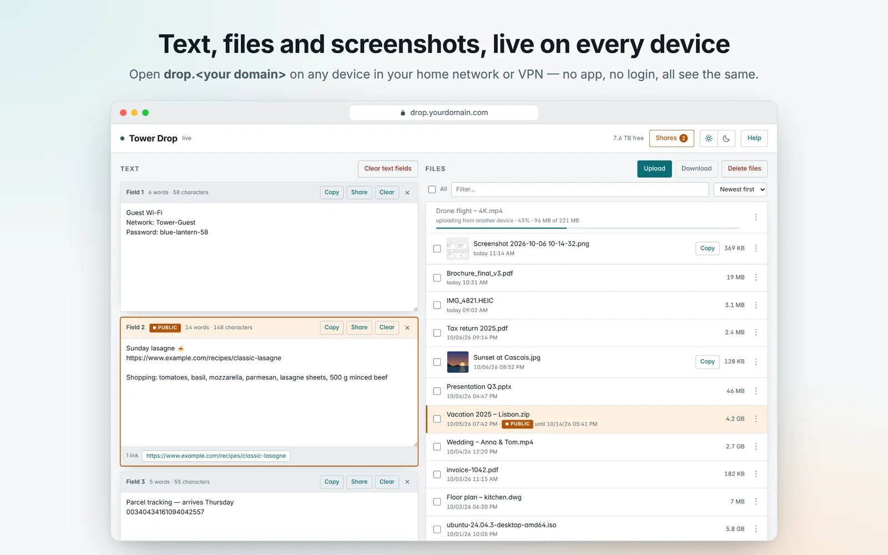</picture></a>
</p>

<p align="center">
  <a href="https://dropnook.app/gallery/#1" title="Text and files"><picture><source media="(prefers-color-scheme: dark)" srcset="docs/screenshots/1-overview-dark-thumb.webp"></picture></a>
  <a href="https://dropnook.app/gallery/#2" title="Sharing"><picture><source media="(prefers-color-scheme: dark)" srcset="docs/screenshots/2-share-dark-thumb.webp">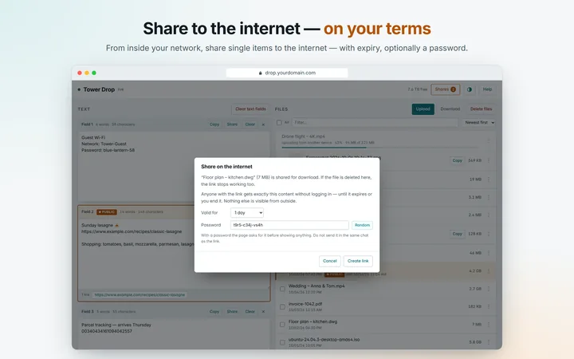</picture></a>
  <a href="https://dropnook.app/gallery/#3" title="What is public"><picture><source media="(prefers-color-scheme: dark)" srcset="docs/screenshots/3-shares-dark-thumb.webp">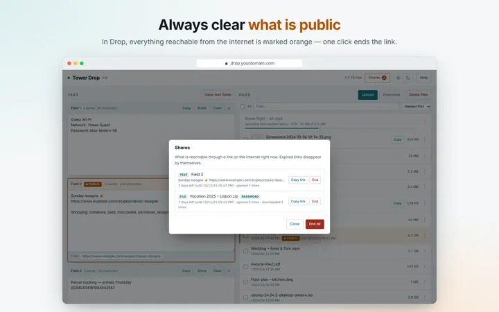</picture></a>
  <a href="https://dropnook.app/gallery/#4" title="Recipient's view"><picture><source media="(prefers-color-scheme: dark)" srcset="docs/screenshots/4-public-dark-thumb.webp">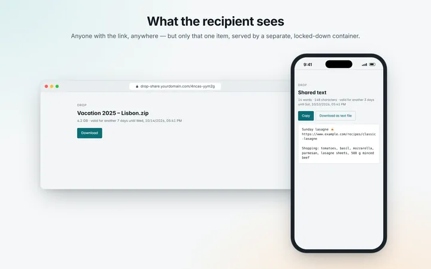</picture></a>
  <a href="https://dropnook.app/gallery/#5" title="Phone"><picture><source media="(prefers-color-scheme: dark)" srcset="docs/screenshots/5-phone-dark-thumb.webp">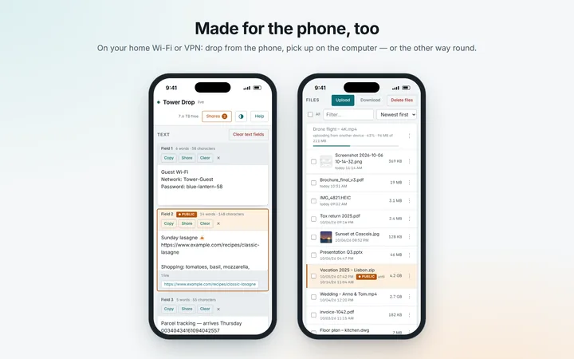</picture></a>
  <a href="https://dropnook.app/gallery/#6" title="17 languages"><picture><source media="(prefers-color-scheme: dark)" srcset="docs/screenshots/6-languages-dark-thumb.webp">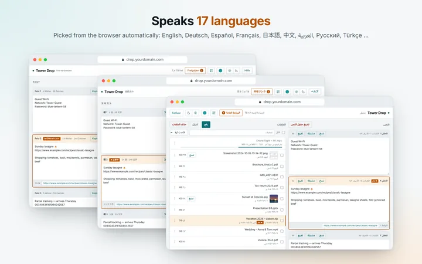</picture></a>
  <a href="https://dropnook.app/gallery/#7" title="Light and dark"><picture><source media="(prefers-color-scheme: dark)" srcset="docs/screenshots/7-theme-dark-thumb.webp">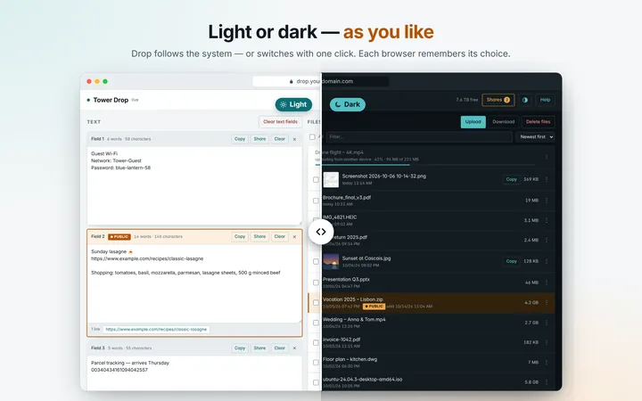</picture></a>
  <a href="https://dropnook.app/gallery/#8" title="Five colours"><picture><source media="(prefers-color-scheme: dark)" srcset="docs/screenshots/8-colours-dark-thumb.webp">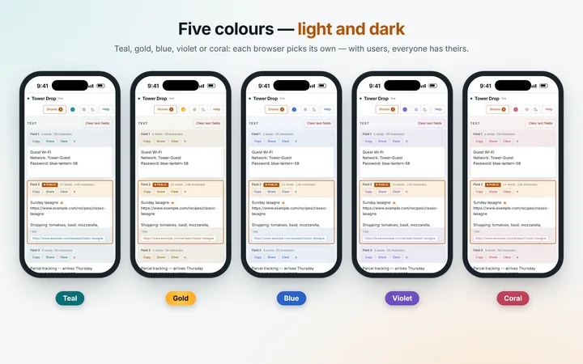</picture></a>
  <a href="https://dropnook.app/gallery/#9" title="Users"><picture><source media="(prefers-color-scheme: dark)" srcset="docs/screenshots/9-users-dark-thumb.webp">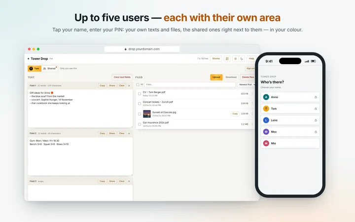</picture></a>
</p>

<p align="center"><sub><a href="https://dropnook.app/gallery/">Open the gallery</a> — browse with arrows, zoom in with a click.</sub></p>

* Text fields with word, character and link counts; unsaved text survives
  reloads and lost connections.
* Uploads of any size — resumable, with progress visible to everyone.
* The page is called "`<server name>` Drop", with the name read live from Unraid.
* Screenshots straight from the clipboard with Ctrl+V; pictures with a preview,
  a large view and *Copy* into the clipboard of another computer.
* 17 languages, picked from the browser.
* Five colour layouts — teal, gold, blue, violet, coral — each in light and dark.
* Optional users: up to five, each with a PIN, an area of their own next to the
  shared one, and their own colour.

| | |
|---|---|
| Containers | `drop` (Drop itself, your network only) and `drop-share` (share links, internet) |
| Image | `ghcr.io/dropnook/dropnook:2` |
| Data | the Unraid share `drop` → `files/`, `texts/`, `shares/` (with users also `users/`) |
| Drop | `https://drop.yourdomain.com` — in your network |
| Share links | `https://drop-share.yourdomain.com/k7m3x-9pq2r` — from anywhere |

`yourdomain.com` stands for your own domain throughout.

Made for Unraid, and this guide is for Unraid — but Drop runs on any Linux
host with Docker Compose, too: see [Without Unraid](docs/DEVELOPMENT.md#without-unraid).

## How it fits together

<p align="center">
  <picture>
    <source media="(prefers-color-scheme: dark)" srcset="docs/diagram/architecture-en-dark.webp">
    
  </picture>
</p>

Your reverse proxy and your certificates stay yours — Drop only expects what is
listed under [What Drop expects from your reverse proxy](#what-drop-expects-from-your-reverse-proxy).

## What you need

* **A server with Docker.** Recommended, and what this guide shows: **Unraid**
  with the plugin **Compose Manager Plus** (*Apps* → search for it →
  *Install*). Any other Linux host with Docker Compose works, too — see
  [Without Unraid](docs/DEVELOPMENT.md#without-unraid).
* **Two free addresses** in your LAN, one for `drop`, one for `drop-share`.
* **Your own domain** with two names — without one, Drop works by IP address,
  just without sharing to the internet and without HTTPS:
  * `drop.yourdomain.com` → the LAN address of `drop` — simplest as a DNS
    record at your domain hoster (a private address there is harmless), or as
    a local DNS entry in your router or DNS server.
  * `drop-share.yourdomain.com` → your public IP address (with a changing IP:
    dynamic DNS).
* **A reverse proxy** reachable from the internet, for sharing.
* Recommended: **a certificate** for `drop.yourdomain.com` (a wildcard
  `*.yourdomain.com` works) — then Drop uses HTTPS in your network, too.

## Installation

### 1. Create a new share "drop" on Unraid

A share of its own for Drop's files and texts. In the Unraid web interface,
*Shares* → *Add Share*:

* Name **`drop`**, on the pool you want.
* *Secondary storage*: **none** (if the share uses Exclusive Access).
* *Minimum free space*: generous — a large upload must not fill the pool to the
  brim.

Drop never creates this share itself. Inside it, it creates `files/`, `texts/`
and `shares/` on its own.

### 2. Check Unraid's Docker network

In the Unraid web interface, *Settings* → *Docker* (switch on *Advanced View*
at the top right):

* Under the custom networks, **`br0`** must show your LAN's subnet and gateway —
  the network both addresses from above are in.
* If your reverse proxy runs on this Unraid in *bridge* or *host* mode, set
  **Host access to custom networks** to *Enabled* — otherwise it cannot reach
  `drop-share`. (Docker has to be stopped to change it.)

### 3. Add Drop as a stack in Compose Manager Plus

In the Unraid web interface, tab *Docker* → section *Compose* further down →
**Add New Stack** → name **`drop`**.

On the new stack, **Edit Stack** → tab **Compose**: paste the content of
[`compose-projects-drop/compose.yaml`](compose-projects-drop/compose.yaml)
([raw](https://raw.githubusercontent.com/dropnook/dropnook.app/main/compose-projects-drop/compose.yaml)).
A PIN or users (optional, can come later) go into the tab **.env** — see
[Where PINs belong](#where-pins-belong-the-env).

Everything you normally change is in the **SETTINGS** block at the top:

| Setting | Preset | What to do |
|---|---|---|
| `drop-ip`, `share-ip` | `<drop-IP>`, `<share-IP>` | **Fill in** the two free addresses |
| `data`, `shares`, `counters` | `/mnt/user/drop/…` | Only if your share has another name or path |
| `appdata` | `/mnt/user/appdata/drop` | Translations of your own; may stay empty |
| `certs` | `…/Nginx-Proxy-Manager-Official/letsencrypt` | The folder holding your certificates |
| `tls-cert`, `tls-key` | `auto`, empty | Leave it — Drop finds the certificate itself (see [HTTPS](#https-in-your-network)) |
| `share-subdomain` | `drop-share` | First part of the share links' name |
| `image` | `ghcr.io/dropnook/dropnook:2` | Leave it — follows every 2.x release |

One line outside SETTINGS: at `drop`, the label `net.unraid.docker.webui` —
put in your name instead of `https://drop.yourdomain.com`. It is what *WebUI* in the
Docker tab opens. Only if you have no domain and do not share to the internet:
`http://[IP]/` works too — Unraid fills in the address.

**Save**. While in *Edit Stack*, tab **Settings** → **Icon URL** gives the stack
its icon:

```
https://raw.githubusercontent.com/dropnook/dropnook.app/main/.github/icons/drop.png
```

Or paste this into the Unraid terminal (**>_** at the top right of the web
interface), then reload the page:

```sh
d=/boot/config/plugins/compose.manager/projects/drop; [ -d "$d" ] && printf '%s' https://raw.githubusercontent.com/dropnook/dropnook.app/main/.github/icons/drop.png > "$d/icon_url" && echo "Icon set" || echo "No stack 'drop' found"
```

### 4. Start the stack

In the *Compose* section, on the stack `drop`: **Compose Up**. `drop` starts
first; as soon as it answers, `drop-share` follows. Both show as *healthy*, each with its own icon.

On the stack, **Logs** — `drop` should say:

```
Certificate found for drop.yourdomain.com: …
Starting on port 443 with TLS
Tower Drop ready — files in /data/files, texts in /data/texts
```

and `drop-share`:

```
Drop — public part on port 80, shares only, from /data/shares
```

> **Tip: HTTPS in your network, too.** If `drop` says `Starting on port 80
> without TLS`, it runs on plain `http://`. That works — but browsers then warn
> about or block downloads ("insecure download"), pictures cannot be copied,
> and the share menu on Android stays closed. Two things make it HTTPS:
>
> 1. **The name:** at your domain hoster, add a DNS record `drop` → the LAN
>    address of `drop` (type A, e.g. `192.168.1.20`). A private address in
>    public DNS is harmless — it only works inside your network. If the name
>    does not resolve at home, your router's DNS rebind protection blocks it:
>    allow `drop.yourdomain.com` there (FRITZ!Box: *Home Network → Network →
>    Network Settings → DNS Rebind Protection*). A local DNS entry in your
>    router or Pi-hole/AdGuard works just as well.
> 2. **The certificate:** Drop usually finds your reverse proxy's certificate
>    by itself — see [HTTPS in your network](#https-in-your-network).
>
> Then open `https://drop.yourdomain.com`, not the IP address.

### 5. Try Drop out

* Open **`https://drop.yourdomain.com`** — the dot at the top left turns green,
  with "live" next to it. *WebUI* on `drop` in the Docker tab opens it too.
* Share a text field (*Share*), copy the link and open it on your phone **with
  Wi-Fi off**.
* `https://drop-share.yourdomain.com/` on its own must show nothing but an error
  page: from outside, only the individual links exist.

## What Drop expects from your reverse proxy

How you run your reverse proxy and where your certificates come from is up to
you. Drop only needs this:

| | |
|---|---|
| Name | `drop-share.yourdomain.com` |
| Forward to | `http://<share-IP>`, port **80** |
| Recommended | HTTPS on **443** with a valid certificate, `http://` redirected to `https://` |
| **Never** | forward anything to `<drop-IP>` |

`drop-share` itself speaks plain HTTP inside your network and never sees a
certificate. As a second line of defence, `drop` refuses every request that
comes through a proxy or from the internet — even a misconfigured proxy does
not reach Drop itself.

## HTTPS in your network

Over plain `http://`, browsers block some downloads ("insecure download"),
copying text works only in a roundabout way and pictures cannot be copied at
all. A certificate for `drop.yourdomain.com` fixes that — usually the one your
reverse proxy already has, if it covers that name (a wildcard
`*.yourdomain.com` does).

Drop reads it from the folder `certs`, read-only. `tls-cert` decides how:

| `tls-cert` | |
|---|---|
| `auto` (preset) | Drop picks the certificates for `drop.yourdomain.com` or `*.yourdomain.com` by itself — one per domain, `drop.yourdomain.com` before `*.yourdomain.com`. With several domains, each name you open Drop under gets its own. The log says which. |
| `yourdomain.com` | The same, for this domain only. |
| `""` | No HTTPS, no search. |
| a file path | Exactly this certificate; `tls-key` then names the key file. |

`certs` is preset to Nginx Proxy Manager's folder; with something else, put in
the folder your certificates live in. Never put certificates into Drop's
`appdata` folder — `drop-share` can read that one.

**Rather not let Drop see all your certificates?** `certs` is mounted
read-only, but `drop` could read every certificate in it — that is how `auto`
finds the right one, and a file path in `tls-cert` only turns off the search,
not the access. To give it just one: copy the certificate chain and its key
into a folder of their own (e.g. `/mnt/user/appdata/drop-certs/`), set `certs`
to that folder and `tls-cert`/`tls-key` to the two files. Drop then sees
nothing else — but renewals are up to you: copy the new files there after
each one (e.g. with the *User Scripts* plugin); Drop picks them up by itself.
With Nginx Proxy Manager, mounting only `live/npm-<N>` does not work — the
files there are links into `archive/`. Without HTTPS in your network at all:
`tls-cert: ""`, and remove the `certs` entry under `volumes` of `drop`.

**If `auto` does not get a certificate** — on the stack `drop` in the
*Compose* section, open **Logs** of the container `drop`. Right after the start
it says what it found, and the fix goes into the SETTINGS of the `compose.yaml`
(*Edit Stack* → *Compose*, then **Compose Up**):

| The log says | What to change |
|---|---|
| `No certificate for drop.<domain> … in <folder>` and the folder is not where your certificates are | `certs` → the folder holding them, e.g. `/mnt/user/appdata/<your proxy>/letsencrypt` |
| `No certificate …` although the folder is right | None of the certificates covers `drop.yourdomain.com` — get one for `*.yourdomain.com` (or `drop.yourdomain.com`) in your proxy |
| `Certificate found for …` lists a domain you do not want | `tls-cert: yourdomain.com` — only your domain is used |
| You want one specific certificate | both files by path, e.g. for Nginx Proxy Manager:<br>`tls-cert: /mnt/user/appdata/Nginx-Proxy-Manager-Official/letsencrypt/live/npm-<N>/fullchain.pem`<br>`tls-key: /mnt/user/appdata/Nginx-Proxy-Manager-Official/letsencrypt/live/npm-<N>/privkey.pem` |

Renewed certificates are picked up by themselves: Drop restarts for a moment,
once nothing is being uploaded. Old `http://` bookmarks are redirected.

## Updating

In the Unraid web interface, tab *Docker* → section *Compose* → **Check for
Updates**, then **Update** on the stack `drop`.
Your files, texts and shares stay where they are.

`:2` follows every 2.x release — fixes and new languages, never a breaking
change. An update never touches your `compose.yaml`; if a release changes it,
its release notes say what to take over.

**Coming from 1.x?** Change `:1` to `:2` in the `image` line of `compose.yaml`,
then *Compose Up*. Nothing else changes: without users Drop works as before,
and your files, texts, links and PIN stay as they are. `:1` gets no more
updates.

Security updates reach the image on their own: every Monday the current release is
rebuilt on a fresh base image (Debian, Python, OpenSSL) whenever that base has
changed. *Check for Updates* then shows an update for the same version — take
it like any other. Every image is tested before it is published.

## Using Drop

**Text fields** — three to start with, more with "+ Text field"; `×` removes one
for everyone. If someone removes a field while you still have unsaved text in
it, you are offered to keep it as a new field. If two people save the same
field at once, the second one is asked which version to keep.

**Screenshots and pictures** — take a screenshot into the clipboard and press
Ctrl+V on the page (⌘V on a Mac): it is uploaded at once and shows up on every
other device, briefly highlighted. Pictures get a small preview in the file
list; a click shows them large (arrows or swiping for the next one). *Copy*
puts the picture itself into the clipboard — ready to paste into a chat, a mail
or a document. That needs [HTTPS](#https-in-your-network); without it,
right-click the large picture and use the browser's *Copy image*. iPhone photos
(HEIC) are kept like any file, but get no preview.

**Sharing** — *Share* on a text field, or *Share on the internet…* in a file's
menu: choose how long the link lives (15 minutes to 30 days) and optionally a
password. **What is public is always visible:** an orange "Public" badge on the
field or file, an orange *Shares* button with the count; *Shares* lists every
open link with its views and downloads and ends any of them at once.

Links look like `drop-share.yourdomain.com/k7m3x-9pq2r` — easy to read out and
type (no 0/o or 1/l/i, case and dash don't matter), and still impossible to
guess. Drop shares only when it is opened by its name: opened by IP address it
cannot know the link's address, and says so.

**Languages** — the page follows the browser: Arabic, Chinese, Dutch, English,
French, German, Hindi, Icelandic, Italian, Japanese, Korean, Norwegian, Polish,
Portuguese, Russian, Spanish and Turkish. To change wording or add a language
for yourself, put a file into `lang/` in the appdata folder — see
[`lang/README.md`](lang/README.md).

**On another device** — the QR button in the header (on computers and tablets)
shows Drop's address as a QR code: point the phone's camera at it, and the page
opens there.

**On the home screen** — Drop can sit there like an app: on the iPhone in Safari
*Share* → *Add to Home Screen*, on Android *Install app* in the browser menu. On
Android it then also shows up in the share menu: share pictures, files or a link
straight to Drop — files land in the list, text and links in a new text field.
The share menu on Android needs [HTTPS](#https-in-your-network).

**Colours, light and dark** — the round button in the header picks one of five
colour layouts: teal, gold, blue, violet or coral. Light and dark follow the
system; ☀ and ☾ next to *Help* pick one by hand, a second click on the chosen
one goes back to automatic. Each browser remembers both. With
[users](#users-optional), the colour is the user's.

<p align="center"><a href="https://dropnook.app/gallery/#8"><picture><source media="(prefers-color-scheme: dark)" srcset="docs/screenshots/8-colours-dark.webp">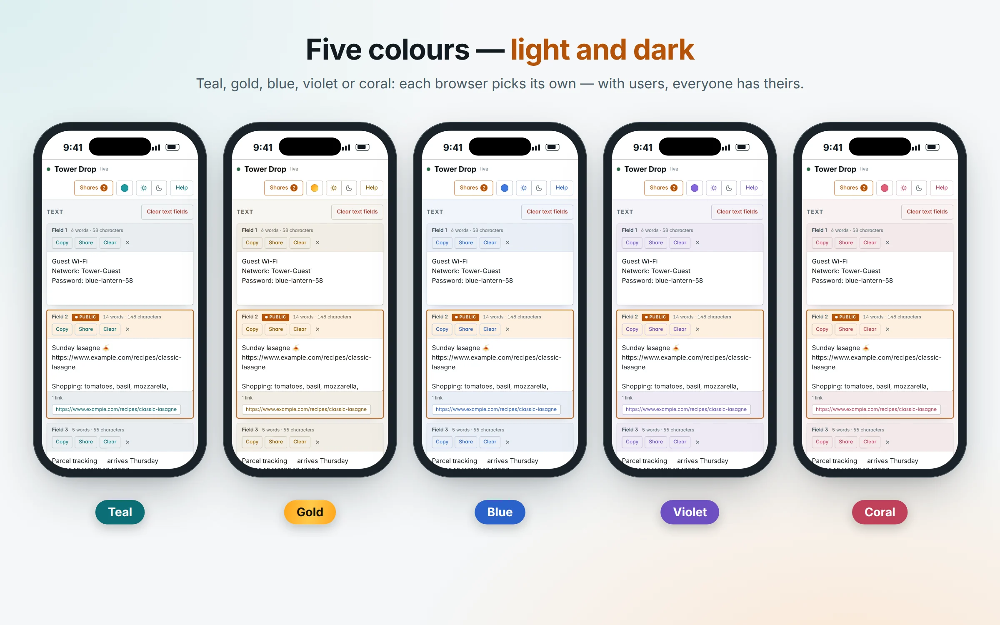</picture></a></p>

**Times** are shown in each viewer's own time zone; nothing to set.

## How it is protected

| Container | sees | reachable |
|---|---|---|
| `drop` | everything: files, texts, shares, certificate | in your network |
| `drop-share` | only `shares/`, read-only (except the view counters) | through your reverse proxy |

`drop-share` runs without root, with a read-only file system, no Linux
capabilities and limited memory. Even a serious bug in it could at most expose
what is shared anyway — your files, the text fields and the certificate do
not exist in that container. It also checks every share record it reads and
ignores any that drop did not write that way.

`drop` needs root to own the data folders, but keeps only the four Linux
capabilities it uses (file ownership, hard links, ports 80/443), cannot gain
more, and has a memory limit. Picture previews are made only from PNG, JPEG,
GIF, WebP, BMP and AVIF, within size and pixel limits — no other decoder ever
sees the file.

Every image is tested before it is published — including these attacks:
path traversal, forged share records, password guessing in parallel, header
injection through file names, disguised picture formats.

* A shared file is a hard link, not a copy — no extra space. Delete the file in
  Drop and its link stops working.
* A shared text is a copy; later edits to the field are not shared.
* Passwords are stored as hashes only; after 10 wrong tries in 15 minutes a link
  is locked for that time.
* Downloads are always attachments — a shared HTML file never runs in the
  browser. Expired links disappear by themselves.

### PIN or password (optional)

Anyone in your network can open Drop — at home that is usually just right.
With guests in your Wi-Fi, or in a network you share, set a PIN or password
in the `.env` of the stack (*Edit Stack* → tab **.env**, see
[below](#where-pins-belong-the-env)):

```sh
PIN=2468
```

Every new browser is asked for it once and stays signed in for 90 days.
Change the PIN (then **Compose Up**) to sign every device out; remove it to
switch the question off. After 10 wrong tries in 15 minutes a browser has to
wait. It keeps out guests in your Wi-Fi — not someone who can get at the
server itself. Share links are not affected; they have a password of their own.

### Users (optional)

Several people, each with something of their own? Give up to five of them a
name, a PIN and a colour — one user per colour, in the `.env` of the stack:

```sh
USER_TEAL=Anna:2468
USER_GOLD=Tom:1357
USER_BLUE=Lena:8642
USER_VIOLET=Max:9753
USER_CORAL=Mia            # without ":PIN": her name alone (or PIN, if set)
```

Drop then starts with "Who's there?": everyone taps their name once per device,
enters their PIN, and stays signed in for 90 days. At the top they switch
between **their own area** — text fields and files only they see — and **the
shared area** everyone sees; a dot shows news in the other one. The page is in
their colour, so it is clear at a glance whose it is. Links shared from an own
area are listed only for that user.

The files are in the share `drop` under `users/<name>/`, the shared area stays
where it was (`files/`, `texts/`). Renaming a user starts an empty area —
rename the folder as well; renaming or removing a user also ends the links
shared from their area. A changed PIN signs that user out, nobody else.
A user without a PIN of their own signs in with `PIN`, if that is set;
otherwise their name alone does, and anyone in your network can open that
area — fine for a living-room TV, not for something private.

#### Where PINs belong: the `.env`

PIN and users are not written into `compose.yaml` but into the **`.env`** next
to it — on Unraid: *Edit Stack* → tab **.env**; elsewhere a file `.env` next to
`compose.yaml`. Template: [`compose-projects-drop/.env.example`](compose-projects-drop/.env.example).
`compose.yaml` only takes the values from there (`PIN: ${PIN:-}`), so the
`.env` always decides, and `compose.yaml` can be shown, posted in a forum or
replaced by a newer one without giving a PIN away.

* Special characters (`$`, `#`, `"`, spaces at the end): put the value in
  single quotes — `PIN='a$b#c'`.
* After a change: **Compose Up**. The log of `drop` says what it found
  (`PIN is set …`, `User Anna (teal): with PIN …`) — if it says nothing of the
  kind, the `.env` was not read.
* The `.env` stays on the server's flash drive with the stack; no container sees
  it. Never put it into Drop's `appdata` folder — `drop-share` can read that.
* Like every setting, the values end up in the container's environment:
  whoever administers the server can see them (`docker inspect`). The PIN
  keeps out guests on your network, not the server's admin.
* From an older `compose.yaml` with `PIN: "…"` written in: move the value into
  the `.env` when you take over the new file.

<p align="center"><a href="https://dropnook.app/gallery/#9"><picture><source media="(prefers-color-scheme: dark)" srcset="docs/screenshots/9-users-dark.webp">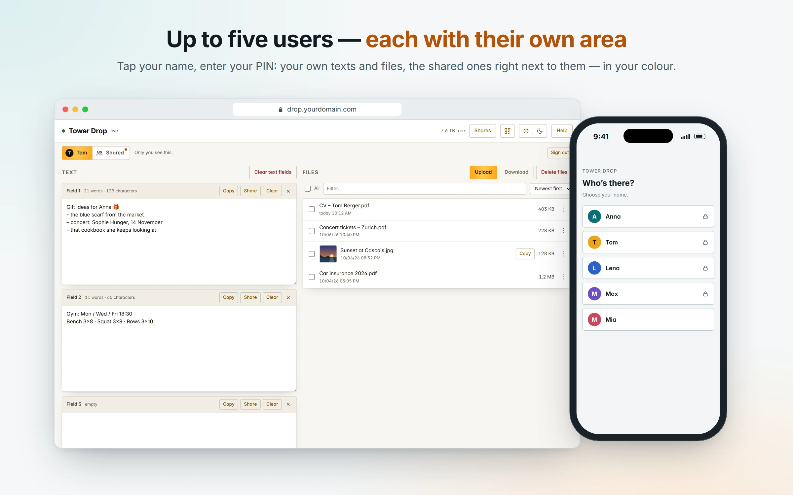</picture></a></p>

## Troubleshooting

**Compose Up: "bind source path does not exist: /mnt/user/drop"** — the share
is missing or named differently (step 1, or `data` in SETTINGS).

**Compose Up: "no configured subnet contains IP address …"** — `br0` does not
carry your LAN's subnet (step 2). In *Settings* → *Docker*: stop Docker, set
*Preserve user defined networks* to *No*, start Docker again — Unraid then
rebuilds `br0` from your network settings.

**A share link gives "502 Bad Gateway"** — the reverse proxy does not reach
`drop-share`: does it forward to `<share-IP>` on port 80, and is *Host access to
custom networks* on (step 2)?

**"Sharing only works through the name"** — the page is open by IP address.
Open `https://drop.yourdomain.com` instead.

**Still `http://` although there is a certificate** — the log of `drop` says
why: *No certificate for drop.… in …* — see [If `auto` does not get a
certificate](#https-in-your-network).

**"Copying pictures needs HTTPS"** — the page is open over `http://` or by IP
address. Open `https://drop.yourdomain.com` (see [HTTPS](#https-in-your-network)).

**A picture has no preview** — HEIC (iPhone photos) gets none; neither does a
picture larger than 80 MB or 60 megapixels, nor a file whose content is not
what its extension says.

**Compose Up: "Your kernel does not support swap limit capabilities … Memory
limited without swap"** — harmless. Both containers have a memory limit (a
safeguard); Unraid's kernel cannot also limit swap, and Unraid normally has no
swap anyway. The limit works as it should.

**PIN or users are not asked for** — the `.env` was not read: on Unraid it
belongs into *Edit Stack* → tab **.env**, elsewhere into a file `.env` next to
`compose.yaml`; then **Compose Up**. The log of `drop` says what it found.

**The dot at the top left stays red** — the browser does not reach `drop`: is
the stack running, does `drop.yourdomain.com` point to `<drop-IP>`? You can keep
typing; unsaved text is sent once the connection is back.

## What Drop deliberately does not do

* No folders — zip them first. An uploaded ZIP is stored, not extracted.
* No permissions or roles: whoever gets in may do everything in the areas they
  see, including sharing to the internet. Users only separate own areas from
  the shared one; there is no admin.
* No recycle bin. Deleted is deleted.
* Nothing in Drop expires by itself — only share links do. Keep an eye
  on the free space shown at the top right.
* No uploads from outside. Sharing works in one direction only: out.

## Support Dropnook

Dropnook is free and stays free. If it is useful to you, you can say thanks
with a donation: **[paypal.me/vipermark2](https://www.paypal.com/paypalme/vipermark2)**. Ideally 5 € (or $5, 5 CHF)
or more — PayPal keeps a fixed fee plus a few percent of every payment, so of a
single euro hardly anything arrives.

---

<sub>All settings, building the image yourself and releasing:
[docs/DEVELOPMENT.md](docs/DEVELOPMENT.md). Dropnook is free software under the
[GNU Affero General Public License v3.0](LICENSE); the name Dropnook™ is not
part of that license — see [TRADEMARKS.md](TRADEMARKS.md).</sub>
